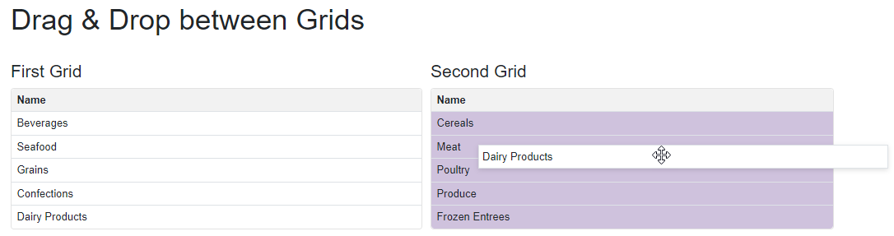

<!-- default badges list -->
[](https://docs.devexpress.com/GeneralInformation/403183)
<!-- default badges end -->

# Blazor Grid - Implement Drag and Drop Functionality

You can implement the following drag and drop variants:

- Drag rows in one grid
- Drag rows between two grids
- Drag rows between two grids and drop at the specified position



All these variants are based on the [ObservableCollection](https://docs.microsoft.com/en-us/dotnet/api/system.collections.objectmodel.observablecollection-1?view=net-6.0) data sources. In this case, the Grid component reacts to changes instantly. The drag and drop feature uses jQuery widgets: [draggable](https://jqueryui.com/draggable/), [droppable](https://jqueryui.com/droppable/), and [sortable](https://jqueryui.com/sortable/). Add jQuery links to the `Layout.csthml` file:

```
<script type="text/javascript" src="https://code.jquery.com/jquery-3.6.0.min.js"></script>
<script type="text/javascript" src="https://code.jquery.com/ui/1.13.2/jquery-ui.min.js"></script>
```

This example also applies [CSS styles](./CS/GridDragAndDrop/wwwroot/css/site.css) to visualize the feature:

```
.ui-state-highlight {
    background-color: rgba(var(--bs-primary-rgb), .3);
}

.ui-state-hover {
    background: rgba(var(--bs-primary-rgb), .3);
}

.ui-draggable-dragging {
    box-shadow: 0 2px 6px 0 rgb(0 0 0 / 12%);
}
```

## Drag Rows in One Grid

When you drop a row, the Grid's rows are reordered. The [ReorderGridRows](./CS/GridDragAndDrop/Pages/Within.razor#L48) method uses the Sortable widget to reorder rows.

## Drag Rows Between Two Grids

The [MoveGridRow](./CS/GridDragAndDrop/Pages/Between.razor#L76) method uses the Draggable and Droppable widgets to identify the source and target Grids. When you drop a row, the server action is executed to update data collections.

## Drag Rows Between Two Grids and Drop at the Specified Position

The [ReorderGridRows](./CS/GridDragAndDrop/Pages/KeepIndices.razor#L77) method uses the Sortable widgets and the [connectWith](./CS/GridDragAndDrop/Pages/KeepIndices.razor.js#L23) property to identify and connect the source and target Grids. After that, the server updates source collections.

## Files to Look At

- [Between.razor](./CS/GridDragAndDrop/Pages/Between.razor)
- [Between.razor.js](./CS/GridDragAndDrop/Pages/Between.razor.js)
- [KeepIndices.razor](./CS/GridDragAndDrop/Pages/KeepIndices.razor)
- [KeepIndices.razor.js](./CS/GridDragAndDrop/Pages/KeepIndices.razor.js)
- [Within.razor](./CS/GridDragAndDrop/Pages/Within.razor)
- [Within.razor.js](./CS/GridDragAndDrop/Pages/Within.razor.js)

## Documentation

- [DxGrid](https://docs.devexpress.com/Blazor/DevExpress.Blazor.DxGrid)
