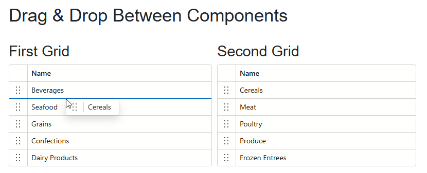

<!-- default badges list -->

<!-- default badges end -->

# Blazor Grid - Incorporate Drag and Drop Support

The DevExpress Blazor Grid supports drag and drop operations.

Use the following API members to activate this feature for your Grids:

- [AllowDragRows](https://docs.devexpress.com/Blazor/DevExpress.Blazor.DxGrid.AllowDragRows) - Specifies whether users can start the row drag operation.
- [AllowedDropTarget](https://docs.devexpress.com/Blazor/DevExpress.Blazor.DxGrid.AllowedDropTarget) - Specifies allowed drag and drop targets.

When a user drops rows, the [ItemsDropped](https://docs.devexpress.com/Blazor/DevExpress.Blazor.DxGrid.ItemsDropped) event fires. In its handler, update the data source: insert rows at the drop position and remove them from the initial position, if required.

## Reorder Rows in a Grid

If you want to active the reorder capability, set the [AllowDragRows](https://docs.devexpress.com/Blazor/DevExpress.Blazor.DxGrid.AllowDragRows) property to `true`. You can test this usage scenario on the **Reorder** page.

## Drag Rows Between Components

To activate row dragging between components, do the following:

- Set the [AllowDragRows](https://docs.devexpress.com/Blazor/DevExpress.Blazor.DxGrid.AllowDragRows) property to `true`.
- Set the [AllowedDropTarget](https://docs.devexpress.com/Blazor/DevExpress.Blazor.DxGrid.AllowedDropTarget) to `External`. You can use the `All` option if you want to also allow reordering.

The [DropTargetMode](https://docs.devexpress.devx/Blazor/DevExpress.Blazor.DxGrid.DropTargetMode) property specifies whether the drop position is defined by [TargetItem](https://docs.devexpress.com/Blazor/DevExpress.Blazor.GridItemsDroppedEventArgs.TargetItem) and [DropPosition](https://docs.devexpress.com/Blazor/DevExpress.Blazor.GridItemsDroppedEventArgs.DropPosition) properties. Otherwise, the target indicator highlights the entire data area. You need to implement custom insertion logic (for example, if your data is sorted or grouped) in the [ItemsDropped](https://docs.devexpress.com/Blazor/DevExpress.Blazor.DxGrid.ItemsDropped) event handler. 

You can test this usage scenario on the **Between** page.

## Files to Look At

- [Between.razor](./CS/GridDragAndDrop/Pages/Between.razor)
- [Reorder.razor](./CS/GridDragAndDrop/Pages/Reorder.razor)

## Documentation

- [Drag and Drop Rows in Blazor Grid](https://docs.devexpress.com/Blazor/405231/components/grid/drag-and-drop-rows)

<!-- feedback -->
## Does this example address your development requirements/objectives?

 

(you will be redirected to DevExpress.com to submit your response)
<!-- feedback end -->
